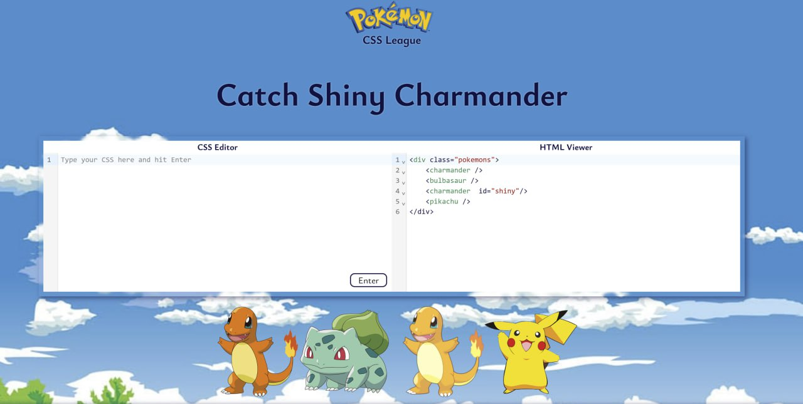

# Pokémon CSS League

Pokemon CSS League is a fun and interactive playground designed to help you master CSS selectors. Dive into the world of Pokémon-themed challenges while improving your CSS skills through an engaging and gamified experience.

## 🌐 [Live Demo](https://okitel.github.io/pokemon-css-league/)

### 📸 Screenshot

### 🎯 Features

- Interactive Learning: Solve CSS selector challenges in a Pokémon-inspired environment.
- Gamified Experience: Progress through levels, and enjoy the Pokémon theme while learning.
- CodeMirror Integration: Provides a clean and responsive code editor for a seamless coding experience.

### 🛠️ Technologies Used

- TypeScript
- SCSS
- Webpack
- Jest
- ESLint and Prettier
- CodeMirror

### ✨ Acknowledgments

Inspired by the Pokémon universe  
Built with love and a passion for CSS education🧸❤️
